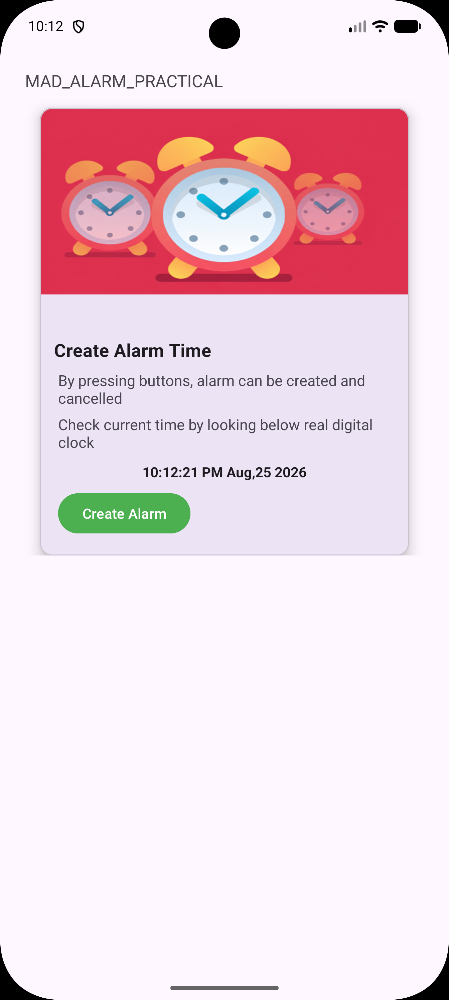
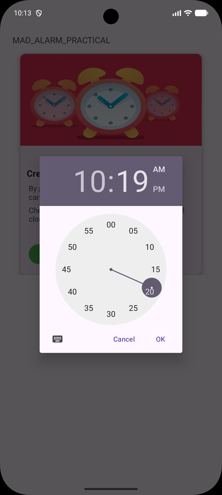
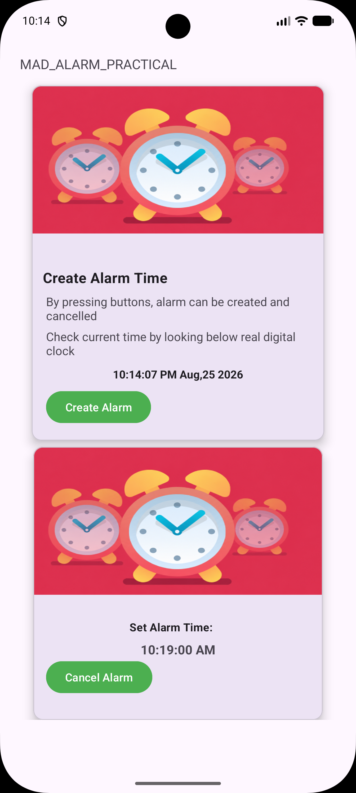

# Practical-4

**Aim:** Develop an Android Alarm application using a `Service` and `BroadcastReceiver`.

## Project Overview

This application demonstrates the implementation of alarm scheduling in Android using `AlarmManager`, along with background processing through a `Service` and a `BroadcastReceiver`.

### Main Components

- **MainActivity:** Provides the main interface where the user can select an alarm time using a `TimePickerDialog`. It calculates the required delay and schedules the alarm.
- **AlarmManager:** Used to schedule the alarm at the selected time, even when the application is not actively open.
- **AlarmBroadcastReceiver:** Receives the broadcast when the scheduled alarm is triggered and starts the `AlarmService`.
- **AlarmService:** Manages the alarm sound using `MediaPlayer` and continues playing the ringtone until the user stops or cancels it.
- **Material Design UI:** Uses components such as `MaterialCardView`, `MaterialButton`, and `TextClock` to provide a clean and responsive interface.

## Screenshots

<table>
  <tr>
    <td align="center">
      
       
      <b>1. Main Alarm Screen</b>
    </td>

    <td align="center">
      
       
      <b>2. Select Alarm Time</b>
    </td>

    <td align="center">
      
       
      <b>3. Alarm Created</b>
    </td>
  </tr>
</table>

---

## Application Working

1. The application displays the current date and time.
2. The user presses the **Create Alarm** button.
3. A time picker appears for selecting the required alarm time.
4. After selecting the time, the alarm is scheduled using `AlarmManager`.
5. `AlarmBroadcastReceiver` receives the alarm broadcast when the selected time is reached.
6. The receiver starts `AlarmService`.
7. `AlarmService` plays the alarm ringtone using `MediaPlayer`.
8. The user can cancel the scheduled alarm using the **Cancel Alarm** button.

---

**Enrollment No:** 24012011134

**Last Updated:** August 25, 2026
